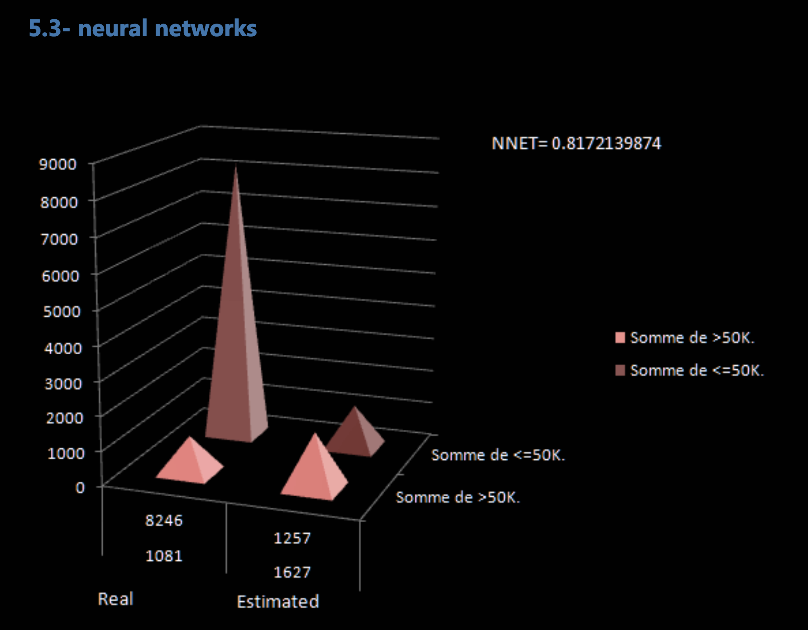
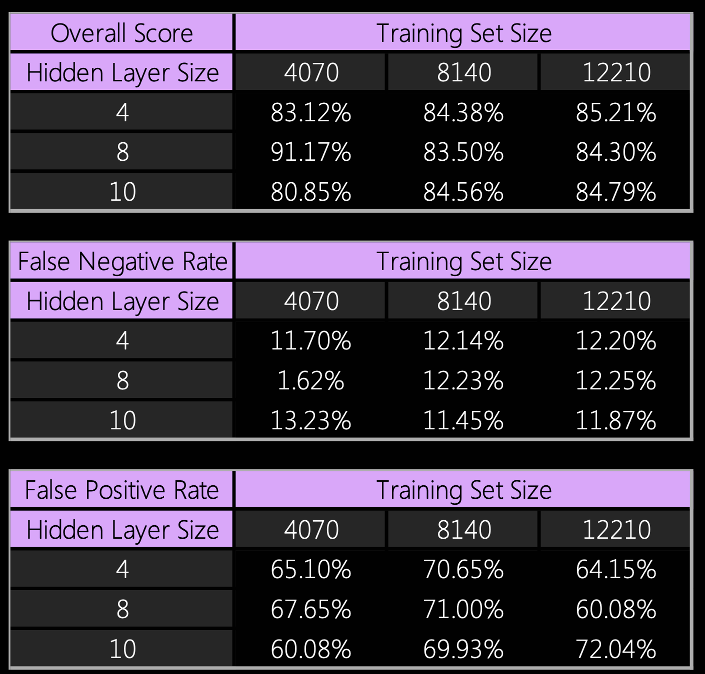
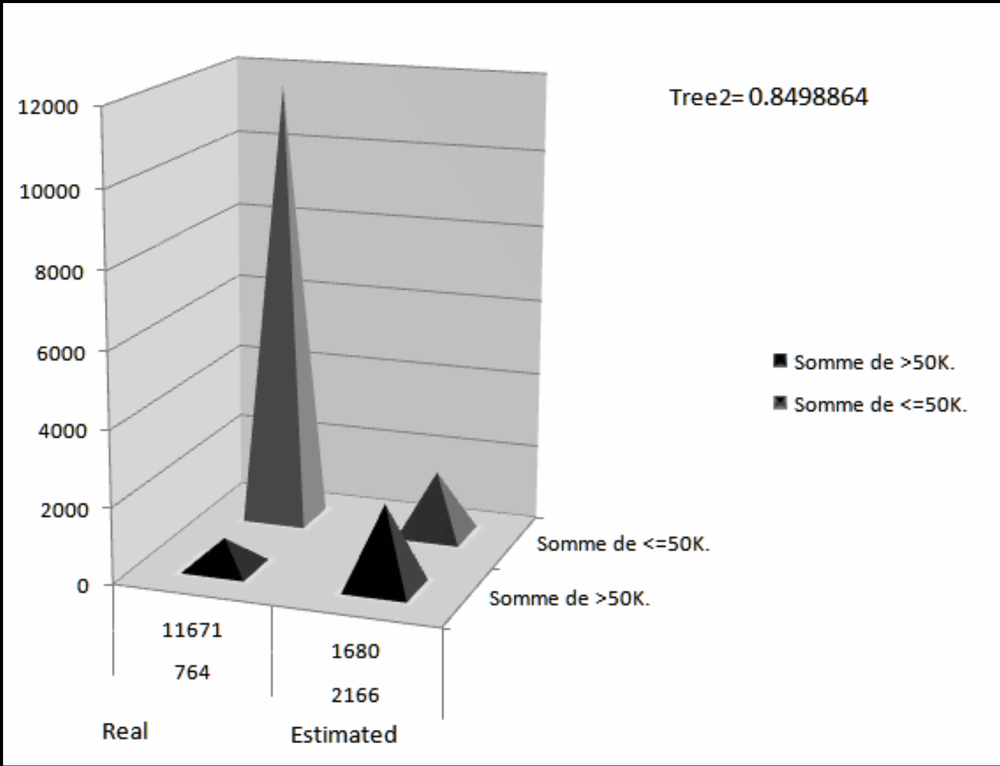
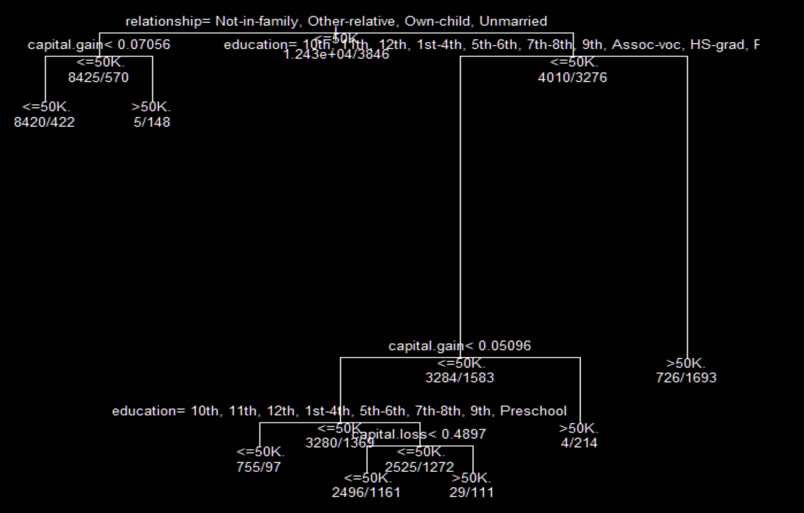
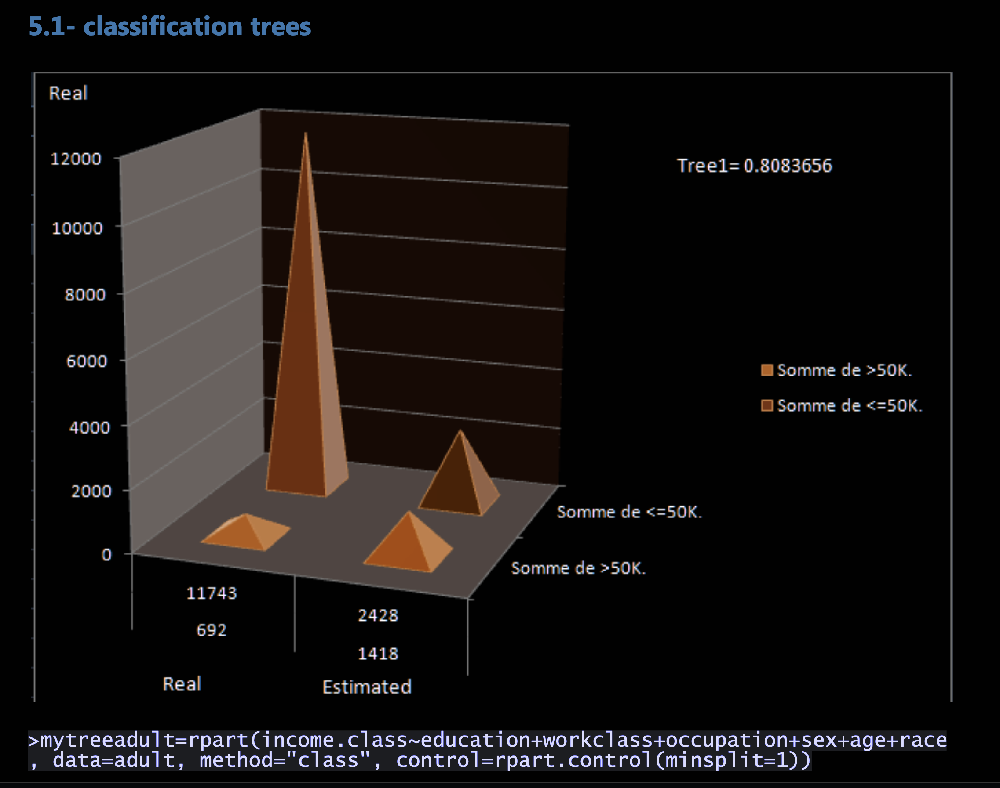
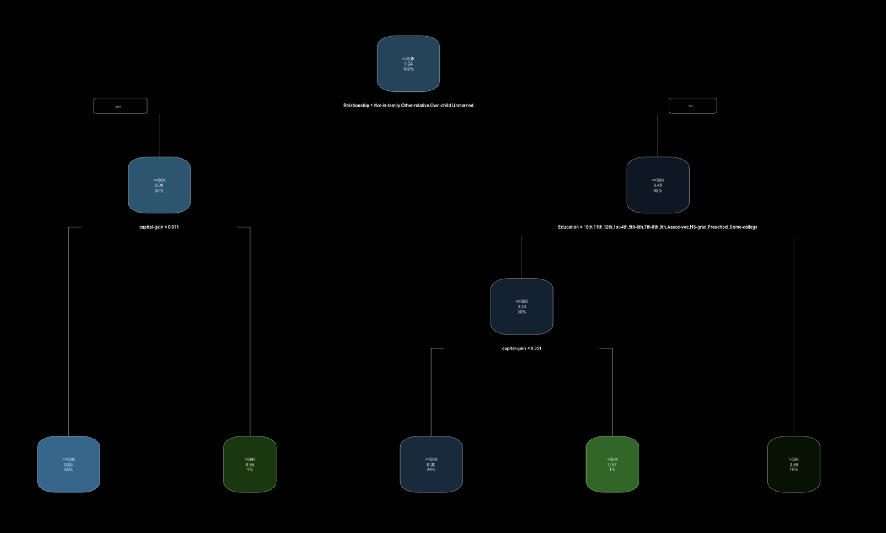
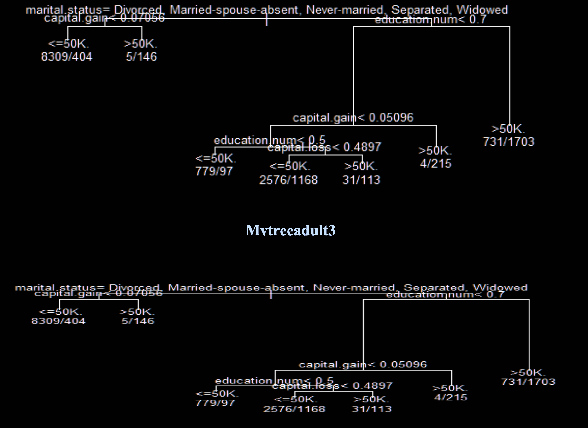

#Technology: I used R for the analysis (here is the code) \
# US Census Bureau famous dataset I use with R Langage for an Price Water House assignment 
## I used 2 algormithms for the models: 1 base-ruled Decision Tree and 1 Artificial Neural Network

##Auteur: Dominique Loyer \
### Results and limitations \
2044 master and doctorate plus grand que 50k 1181 = 3,87% \
23265 plus petit ou égal 50k\
**please use citation key pour all documents and codes except Final Project:**  Citation Key: loyerCensusBureauAssignment2018

**For Final Project** : Citation Key: loyerdominiqueloyermahmoudmohannaisabellerochetteratiarayromeoravelonjanaharyFinalProjectMaster2014

missing data\
workclass 1769\
occupation Status 1774
native country 531	\


#Question 1 and 2 and exploration of data \
```R
Census <- read_excel("~/Desktop/PwC/Census.xlsx")
View(Census)
summary(Census)
attach(Census)
str(Census)
head(Census)
tail(Census)
getwd()
pwc <- read_excel("Census.xlsx")
view(pwc)
pwc
View(pwc)
str(pwc)
head(pwc)
subset (pwc, Education %in% "Masters")
subset (pwc, Education %in% "Masters" AND `Income Group` %in% "50k" OR `Income Group` %in% "50k.")
subset (pwc, Education %in% "Masters" AND Income Group %in% "50k" OR Income Group %in% "50k.")
subset (pwc, Education %in% "Masters" OR "Doctorates")
subset (pwc, Education %in% "Masters" | "Doctorates")
subset (pwc, Education %in% "Masters"|"Doctorates")
subset (pwc, Education %in% "Masters")
master <- subset (pwc, Education %in% "Masters")
filter(master)
master50kplus <- subset (pwc, `Income Group` %in% "50k")
master50kplus
master50kplusDot <- subset (master50kplus, `Income Group` %in% "50k.")
master50kplusDot
master
master50kplus <- subset (master, `Income Group` %in% "50k")
master50kplus
master50kplus <- subset (master, `Income Group` %in% ">50k")
master50kplus
master50kplus <- subset (master, `Income Group` %in% >50k)
master50kplus <- subset (master, `Income Group` >50k)
master50kplus <- subset (master, `Income Group` >50k)
master
master$`Income Group`
master50kplus <- subset (master, `Income Group` %in% ">50K")
master50kplus
master50kplusDot <- subset (master50kplus, `Income Group` %in% ">50K.")
master50kplusDot
master50kplus
master50kplusDot <- subset (master, `Income Group` %in% ">50K.")
master50kplus+master50kplusDot
master50kplusDot
dim(master50kplus)
dim(master50kplusDot)
426+500
totalMaster50kplus <- 500+426
totalMaster50kplus
doctorate <- subset (pwc, Education %in% "Doctorate")
doctorate
doctorate50kplus <- subset (doctorate, `Income Group` %in% ">50K")
doctorate50kplus
doctorate50kplusDot <- subset (doctorate, `Income Group` %in% ">50K.")
doctorate50kplusDot
dim(doctorate50kplus)
dim(doctorate50kplusDot)
totalDoctorate50plus <- 130+125
totalDoctorate50plus
totalDoctorate50plus+totalMaster50kplus
TotalDocPlusMasterEarn50kplus <- totalDoctorate50plus+totalMaster50kplus
TotalDocPlusMasterEarn50kplus / 30511
people50less <- subset (pwc, `Income Group` %in% "<=50K")
people50less
people50lessDot <- subset (pwc, `Income Group` %in% "<=50K.")
people50lessDot
dim(people50less)
dim(people50lessDot)
peopleLess50K <- 10835+12430
peopleLess50K
plot(peopleLess50K)
hist(peopleLess50K) \
```

#Question 3 \

##Cleaningmytreeadult \
```R
###categorical variables as factor
pwcClean$workclass <- as.factor(pwcClean$workclass)
pwcClean$`Income Group` <- as.factor(pwcClean$`Income Group`)
pwcClean$Education <- as.factor(pwcClean$Education)
pwcClean$`Occupation Status` <- as.factor(pwcClean$`Occupation Status`)
pwcClean$Relationship <- as.factor(pwcClean$Relationship)
pwcClean$Gender <- as.factor(pwcClean$Gender)
pwcClean$`Native country` <- as.factor(pwcClean$`Native country`)
summary(pwcClean)
pwcClean$`Marital Status` <- as.factor(pwcClean$`Marital Status`)
summary(pwcClean)
pwcClean$Age=(pwcClean$Age-min(pwcClean$Age))/(max(pwcClean$Age)-min(pwcClean$Age))

range(pwcClean$`Demographic Adjustment`)
hist(pwcClean$`Demographic Adjustment`)

###replacing missing values and merging Income Group (50k and 50k.)

install.packages("tidyr")
library("tidyr")
pwc$`Occupation Status` <- sub("?", "Other-service", pwc$`Occupation Status`)
subset (pwc, Education %in% "Masters" AND `Income Group` %in% "50k" OR `Income Group` %in% "50k.")
pwc$workclass[pwc$workclass==" ?"] = as.character(sample(pwc$workclass[which(pwc$workclass !=" ?")], 1774, replace = FALSE))
people50lessDot <- subset (pwc, `Income Group` %in% "<=50K.")
people50less <- subset (pwc, `Income Group` %in% "<=50K")


###normalization with Min-Max
pwcClean$`Demographic Adjustment`=(pwcClean$`Demographic Adjustment`-min(pwcClean$`Demographic Adjustment`))/(max(pwcClean$`Demographic Adjustment`)-min(pwcClean$`Demographic Adjustment`))
hist(pwcClean$`Demographic Adjustment`)
pwcClean$`Years of Education`=(pwcClean$`Years of Education`-min(pwcClean$`Years of Education`))/(max(pwcClean$`Years of Education`)-min(pwcClean$`Years of Education))
pwcClean$`Years of Education`=(pwcClean$`Years of Education`-min(pwcClean$`Years of Education`))/(max(pwcClean$`Years of Education`)-min(pwcClean$`Years of Education))
pwcClean$`Years of Education`=(pwcClean$`Years of Education`-min(pwcClean$`Years of Education`))/(max(pwcClean$`Years of Education`)-min(pwcClean$`Years of Education`))
pwcClean$`capital-gain`=(pwcClean$`capital-gain`-min(pwcClean$`capital-gain`))/(max(pwcClean$`capital-gain`)-min(pwcClean$`capital-gain`))
pwcClean$`capital-loss`=(pwcClean$`capital-loss`-min(pwcClean$`capital-loss`))/(max(pwcClean$`capital-loss`)-min(pwcClean$`capital-loss`))
pwcClean$`hours-per-week`=(pwcClean$`hours-per-week`-min(pwcClean$`hours-per-week`))/(max(pwcClean$`hours-per-week`)-min(pwcClean$`hours-per-week`))

###Normalized and cleaned data
pwcClean.normalized <- pwcClean
pwcClean.normalizedCopy <- pwcClean.normalized


#Decision Tree
##pruning the tree with rpart
install.packages("rpart")
library(rpart)
library(rpart.plot)
mytreeadult=rpart(`Income Group`~Education+workclass+`Occupation Status`+Gender+Age+`hours-per-week`
, data=pwcClean.normalized, method="class", control=rpart.control(minsplit=1))
mytreeadult
plot(mytreeadult)
rpart.plot(mytreeadult, type=3, extra=101, fallen.leaves = TRUE)
text(mytreeadult, use.n=T, all=T, pretty=0, cex=0.9, xpd=TRUE)
estincome.class=predict(mytreeadult, data=pwcClean.normalized, type="class")

##cross-validation table

t1=table(`Income Group`, estincome.class)
t1
(10061+1354)+(11564+1505)/30511
(10061+1354+11564+1505)/30511


###Training data 20000 out of 30511
index <- sample(1:nrow(pwcClean.normalized), 20000)
pwc.test = pwcClean.normalized[index,]
pwc.valid = pwcClean.normalized[-index,]

###validation data
Tpwc=table(pwc.valid$`Income Group`,pwc.valid$est.income)
Tpwc
(7457+1519)/(30511-20000)

#Neural network with 10 hidden layers

require(nnet)
library(nnet)
set.seed(99999999)

pwc.net = nnet(`Income Group`~.,data=pwc.test,size=10)
pwc.valid$est.income = predict(pwc.net,pwc.valid,type="class")
Tpwc=table(pwc.valid$`Income Group`,pwc.valid$est.income)
Tpwc














